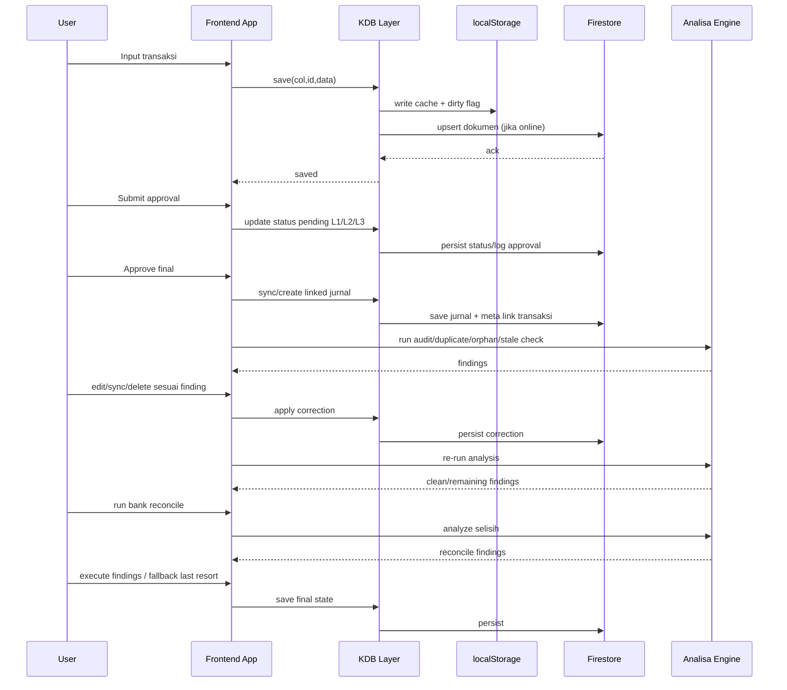

# Diagram Backend Workflow Transaksi

## Akses Cepat

- Buka viewer interaktif: [backend-workflow-transaksi.html](./backend-workflow-transaksi.html)
- Buka gambar flow (SVG): [backend-workflow-transaksi-flow.svg](./backend-workflow-transaksi-flow.svg)
- Buka gambar sequence (SVG): [backend-workflow-transaksi-sequence.svg](./backend-workflow-transaksi-sequence.svg)
- Buka gambar flow (PNG): [backend-workflow-transaksi-flow.png](./backend-workflow-transaksi-flow.png)
- Buka gambar sequence (PNG): [backend-workflow-transaksi-sequence.png](./backend-workflow-transaksi-sequence.png)
- Buka source flowchart: [backend-workflow-transaksi.mmd](./backend-workflow-transaksi.mmd)
- Buka source sequence: [backend-workflow-transaksi-sequence.mmd](./backend-workflow-transaksi-sequence.mmd)
- Jika tetap terbuka sebagai teks, gunakan Explorer lalu klik file `backend-workflow-transaksi.html`.

## Flow End-to-End

```mermaid
flowchart TD
    A([Mulai Transaksi]) --> B[User Input Draft Transaksi]
    B --> C{Jenis Transaksi}
    C --> C1[Permohonan Dana]
    C --> C2[Dana Masuk]
    C --> C3[Jurnal Manual]

    C1 --> D[Validasi Form: nominal, akun, keterangan, bukti]
    C2 --> D
    C3 --> D

    D --> E[KDB.save ke localStorage cache]
    E --> F{Firebase Ready?}
    F -- Ya --> G[Sinkron ke Firestore]
    F -- Tidak --> H[Simpan dirty flag lokal, retry nanti]
    G --> I[Status Draft Tersimpan]
    H --> I

    I --> J{Submit Approval?}
    J -- Tidak --> K[Edit Draft / Tetap Draft]
    K --> I
    J -- Ya --> L[Naik ke Approval Layer 1]

    L --> M{Approve L1?}
    M -- Tidak --> N[Reject + catatan revisi]
    N --> K
    M -- Ya --> O[Approval Layer 2]

    O --> P{Approve L2?}
    P -- Tidak --> N
    P -- Ya --> Q[Approval Layer 3 Final]

    Q --> R{Approved Final?}
    R -- Tidak --> N
    R -- Ya --> S[Trigger Auto Integrasi Jurnal]

    S --> T{Jurnal linked sudah ada?}
    T -- Ya --> U[Sync jurnal linked sesuai data terbaru]
    T -- Tidak --> V[Buat jurnal baru + meta link]
    U --> W[Jurnal Umum Terupdate]
    V --> W

    W --> X[Masuk Monitoring: Buku Besar, Saldo, Dashboard]
    X --> Y[Masuk Engine Analisa/Audit]
    Y --> Z{Ada Temuan? duplicate/orphan/stale/wrong-bank}
    Z -- Tidak --> AA[Transaksi dianggap sehat]
    Z -- Ya --> AB[User review temuan]

    AB --> AC{Aksi Koreksi}
    AC --> AC1[View Detail]
    AC --> AC2[Edit Jurnal]
    AC --> AC3[Sync Link]
    AC --> AC4[Hapus ke Trash]

    AC1 --> AD[Re-analisa]
    AC2 --> AD
    AC3 --> AD
    AC4 --> AD

    AD --> AE{Masih ada temuan kritis?}
    AE -- Ya --> AB
    AE -- Tidak --> AF[Lanjut Rekonsiliasi]

    AF --> AG[Bank Reconcile: bandingkan saldo sistem vs aktual]
    AG --> AH{Selisih ada?}
    AH -- Tidak --> AI[Reconcile selesai]
    AH -- Ya --> AJ[Analisa Rekonsiliasi dulu]
    AJ --> AK[Eksekusi per temuan]
    AK --> AL{Selisih selesai?}
    AL -- Ya --> AI
    AL -- Tidak --> AM[Fallback Koreksi Saldo Awal - opsi terakhir]
    AM --> AI

    AI --> AN[Periode Akhir: Jurnal Penyesuaian]
    AN --> AO[Neraca Lajur Review]
    AO --> AP[Jurnal Penutup]
    AP --> AQ[Generate Laporan: LR, Neraca, Arus Kas, Ekuitas]
    AQ --> AR[Export/Print/Arsip]
    AR --> AS([Selesai End-to-End])
```

## Sequence Request-Response

